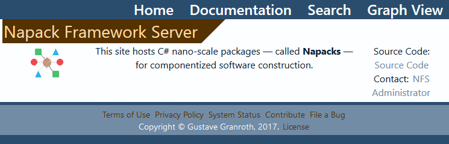
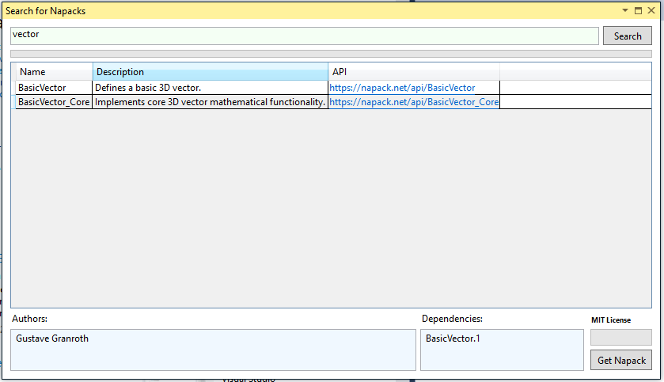

# napack
## Synopsis
-----------
A nano-scale package framework implementation that supports automatic semantic versioning, automatic documentation generation, and automatic attribution license formatting -- in addition to [NuGet](https://www.nuget.org/)-like functionality such as package searching, downloading, and MSBUILD integration.

**Napack Framework Server Homepage**

## Contents
---------
This repository contains the Napack Framework server, client (with NuGet package), Visual Studio extension, documentation, and test code.

**Napack Visual Studio Extension**

## Full Documentation
[Readme.md](./server/Content/docs/Readme.md)

## Status
---------
## Complete -- Decommissioned

Unfortunately, this nano-scale package framework didn't turn out to be as small scale as I wanted it to be. There were a number of issues that swayed me to decommission this project:
- Adding new Napacks would require either a project update or IntelliSense would not work.
- Several of the features were forced to conform to C#  (automatic versioning and documentation generation, for example) and [NuGet](https://www.nuget.org/) already has an entrenched hold on the packaging world for C#.
- Forming new Napacks ended up being a contradictory process: The Napacks were supposed to be as small as possible (as a Napack was supposed to cover only an *algorithm* worth of code), but ended up being rather large (as in practise you'd create a new .CSPROJ for the Napack, make a new Napack definition file, write in the description & tags, etc).
- Maintaining the Napack Framework Server (while inexpensive) was not worthwhile when there was only a single consumer of the Napack system.

